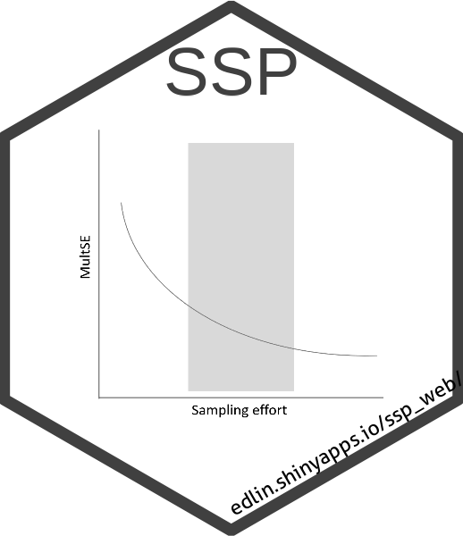

<!-- README.md is generated from README.Rmd. Please edit that file -->

```{r, include = FALSE}
knitr::opts_chunk$set(
  collapse = TRUE,
  comment = "#>",
  fig.path = "man/figures/README-",
  out.width = "100%"
)
```

# SSP development version



## Estimation of sampling effort in community ecology with SSP

Edlin Guerra-Castro, Juan Carlos Cajas, Juan Jose Cruz-Motta, Nuno Simoes and Maite Mascaro

**SSP** is an R package design to estimate sampling effort in studies of ecological communities based on the definition of *pseudo*-multivariate standard error (*MultSE*) [(Anderson & Santana-Garcon 2015)](https://doi.org/10.1111/ele.12385) and simulation of community data and resampling [(Guerra-Castro et al., 2021)](https://doi.org/10.1111/ecog.05284).

**SSP** includes seven functions: `assempar` for extrapolation of assemblage parameters using pilot data; `simdata` for simulation of several data sets based on extrapolated parameters; `datquality` for evaluation of plausibility of simulated data; `sampsd` for repeated estimations of *MultSE* for different sampling designs in simulated data sets; `summary_ssp` for summarizing the behavior of *MultSE* for each sampling design across all simulated data sets, `ioptimum` for identification of the optimal sampling effort, and `plot_ssp` to plot sampling effort vs *MultSE*.

### R Packages needed 

-   Required: [vegan](https://CRAN.R-project.org/package=vegan), [sampling](https://CRAN.R-project.org/package=sampling), [stats](https://CRAN.R-project.org/package=STAT), [ggplot2](https://CRAN.R-project.org/package=ggplot2). These are installed automatically.
-   Suggested: [devtools](https://CRAN.R-project.org/package=devtools), [knitr](https://CRAN.R-project.org/package=knitr), and [rmarkdown](https://CRAN.R-project.org/package=rmarkdown) to build **SSP** from [github](https://github.com/edlinguerra/SSP). All these must be installed by you.

### Installation:

The **SSP** package is available on [CRAN](https://cran.r-project.org/) but can be downloaded from github using the following commands:

```{r eval=FALSE}
## Packages needed to build SSP and vignettes
install.packages(pkgs = c('devtools', 'knitr', 'rmarkdown'))
library(devtools)
library(knitr)
library(rmarkdown)

## install the latest version of SSP from github
install_github('edlinguerra/SSP', build_vignettes = TRUE)
library(SSP)
```

For examples about how to use **SSP**, see `help('SSP')` after installation.
