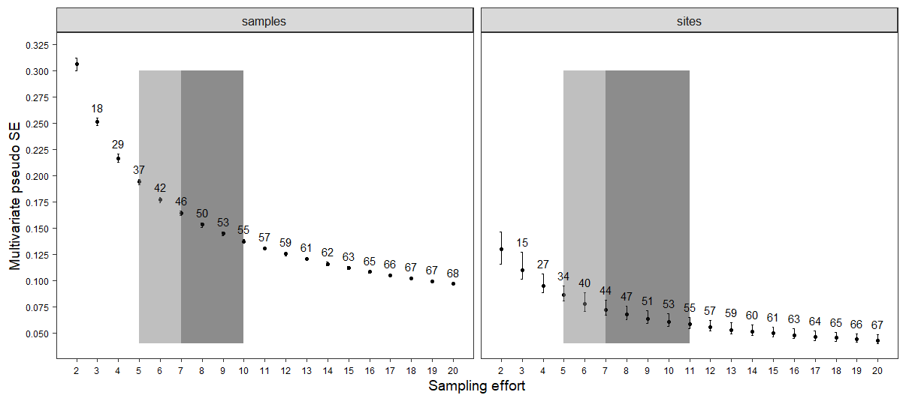

```{r setup, include = FALSE}
library(SSP)
library(ggplot2)

knitr::opts_chunk$set(
  collapse = TRUE,
  comment = "#>",
  fig.retina=2,
  fig.align='center',
  fig.width = 7, 
  fig.height = 5,
  warning = FALSE,
  message = FALSE
)
```
------------

## RATIONALE OF SSP

**SSP** is an R package designed to estimate sampling effort in studies of ecological communities based on the definition of *pseudo*-multivariate standard error (*MultSE*) (Anderson & Santana-Garcon 2015) and simulation of data. This guide will provide you with a brief overview on how to use **SSP**. The theoretical background is described in a submitted paper by Guerra-Castro et al. (2020).

The protocol in **SSP** consists of simulating several extensive data matrices that mimic some of the relevant ecological features of the community of interest using a pilot data set. For each simulated data, several sampling efforts are repeatedly executed and *MultSE* is calculated to each one. The mean value, 0.025 and 0.975 quantiles of *MultSE* for each sampling effort across all simulated data are then estimated and plotted. The mean values are standardized in relation to the lowest sampling effort (consequently, the worst precision), and an optimal sampling effort can be identified as that in which the increase in sample size do not improve the precision beyond a threshold value (e.g. 2.5 %).

**SSP** includes seven functions: `assempar` for extrapolation of assemblage parameters using pilot data; `simdata` for simulation of several data sets based on extrapolated parameters; `datquality` for evaluation of plausibility of simulated data; `sampsd` for repeated estimations of *MultSE* for different sampling designs in simulated data sets; `summary_sd` for summarizing the behavior of *MultSE* for each sampling design across all simulated data sets, `ioptimum` for identification of the optimal sampling effort, and  `plot_ssp` to plot sampling effort vs *MultSE*.

------------

## FUNCTIONS AND SEQUENCE

### 1. assempar

The first function to use is `assempar`. The arguments of this functions are:

<table style="width:100%;">
<colgroup>
<col width="20%">
<col width="80%">
</colgroup>
<thead>
<tr class="header">
<th align="center">Argument</th>
<th align="left">Description</th>
</tr>
</thead>
<tbody>
<tr class="odd">
<td align="center"><code>data</code></td>
<td align="left"><code>data.frame</code> with species names (columns) and samples (rows) information. The first column should indicate the site to which the sample belongs, regardless of whether a single site has been sampled</td>
</tr>
<tr class="even">
<td align="center"><code>type</code></td>
<td align="left">Nature of the data to be processed. It may be presence / absence ("P/A"), counts of individuals ("counts"), or coverage ("cover")</td>
</tr>
<tr class="odd">
<td align="center"><code>Sest.method</code></td>
<td align="left">Method for estimating species richness. The function <code>specpool</code> is used for this. Available methods are the incidence-based Chao "chao", first order jackknife "jack1", second order jackknife "jack2" and Bootstrap "boot". By default, the "average" of the four estimates is used</td>
</tr>

</tbody>
</table>

`assempar` extracts the main parameters of the pilot data using basic R functions combined with `vegan` functions like `specpool` and `dispweight`. The expected number of species in the assemblage is estimated using non-parametric methods (Gotelli et al. 2011). Due to the variability of the estimates of each approximation (Reese et al. 2014), we recommend using an average of these. The probability of occurrence of each species is estimated between and within sites. The former is calculated as the frequency of occurrences of each of the species against the number of sites sampled, the second as the weighted average frequencies in sites where the species were present. Also, the degree of spatial aggregation of species (only for real counts of individuals), is identified with the index of dispersion *D* (Clarke et al. 2006). The corresponding properties of unseen species are approximated using information of observed species. Specifically, the probabilities of occurrences are assumed to be equal to the rarest species of pilot data. The mean (and variance) of the abundances are defined using random Poisson values with lambda as the overall mean of species abundances. `assempar`	returns an object of class `list`, to be used by `simdata`.

## 2. simdata

The second function to use is `simdata`, with the following arguments:

<table style="width:100%;">
<colgroup>
<col width="20%">
<col width="80%">
</colgroup>
<thead>
<tr class="header">
<th align="center">Argument</th>
<th align="left">Description</th>
</tr>
</thead>
<tbody>
<tr class="odd">
<td align="center"><code>Par</code></td>
<td align="left"><code>list</code> of parameters estimated by <code>assempar</code></td>
</tr>
<tr class="even">
<td align="center"><code>cases</code></td>
<td align="left">Number of data sets to be simulated</td>
</tr>
<tr class="odd">
<td align="center"><code>N</code></td>
<td align="left">Total number of samples to be simulated in each site</td>
</tr>
<tr class="even">
<td align="center"><code>sites</code></td>
<td align="left">Total number of sites to be simulated in each data set</td>
</tr>

</tbody>
</table>

The presence/absence of each species at each site are simulated with Bernoulli trials and probability of success equals to the empirical frequency of occurrence of each species among sites in the pilot data. Then, for sites with the simulated presence of the species, Bernoulli trials are used again with probability of success equal to the empirical frequency estimated within the sites in pilot data. If required, the presence/absence matrices are converted to matrices of abundances replacing presences by random values from an adequate statistical distribution and parameters equals to those estimated in the pilot data. Counts of individuals are generated using Poisson or negative binomial distributions, depending on the degree of aggregation of each species in the pilot data (McArdle & Anderson 2004; Anderson & Walsh 2013). When abundances were measured as a continuous variable (i.e. coverage, biomass), they are generated using the lognormal distribution. The simulation procedure is repeated to generate as many simulated data matrices (i.e. cases) as needed. This function returns an object of class `list` that will be used by `sampsd` and `datquality`.

## 3. sampsd

The third function is `sampsd`. If several virtual sites have been simulated, subsets of sites of size 2 to *m* are sampled, followed by the selection of sampling units (from 2 to *n*) using inclusion probabilities and self-weighted two-stage sampling (Tille, 2006). Each combination of sampling effort (number of sample units and sites), are repeated several times (e.g. *k* = 100) for all simulated matrixes. If simulated data correspond to a single site, sampling without replacement is performed several times (e.g. *k* = 100) for each sample size (from 2 to *n*) within each simulated matrix. This approach is computationally intensive, especially when *k* is high. Keep this in mind because it will affect the time to get results. For each sample, suitable pre-treatments are applied and distance/similarity matrixes estimated using the appropriate coefficient. When simulations were done for a single site, the *MultSE* is estimated as \eqn{\sqrt(V/n)}, being *V* the *pseudo*-variance measured at each sample of size *n* (Anderson & Santana-Garcon, 2015). When several sites were generated, *MultSE* are estimated using the residual mean squares and the sites mean squares from a distance-based multivariate analysis of variance (Anderson & Santana-Garcon, 2015). The arguments of this function are:

<table style="width:100%;">
<colgroup>
<col width="20%">
<col width="80%">
</colgroup>
<thead>
<tr class="header">
<th align="center">Argument</th>
<th align="left">Description</th>
</tr>
</thead>
<tbody>
<tr class="odd">
<td align="center"><code>dat.sim</code></td>
<td align="left"><code>list</code> of data sets generated by <code>simdata</code></td>
</tr>
<tr class="even">
<td align="center"><code>Par</code></td>
<td align="left"><code>list</code> of parameters estimated by <code>assempar</code></td>
</tr>
<tr class="odd">
<td align="center"><code>transformation</code></td>
<td align="left">Mathematical function to reduce the weight of very dominant species: 'square root', 'fourth root', 'Log (X+1)', 'P/A', 'none'</td>
</tr>
<tr class="even">
<td align="center"><code>method</code></td>
<td align="left">The appropiate distance/dissimilarity metric. The function <code>vegdist</code> is called for that purpose</td>
</tr>
<tr class="odd">
<td align="center"><code>n</code></td>
<td align="left">Maximum number of samples to take at each site. Can be equal or less than <code>N</code></td>
</tr>
<tr class="even">
<td align="center"><code>m</code></td>
<td align="left">Maximum number of sites to sample at each data set. Can be equal or less than <code>sites</code></td>
</tr>
<tr class="odd">
<td align="center"><code>k</code></td>
<td align="left">Number of repetitions of each sampling effort (samples and sites) for each data set</td>
</tr>

</tbody>
</table>

## 4. summary_ssp

The fourth function is `summary_ssp`.  This function is required to estimate an average of all *MultSE* obtained with the *k* repetitions for each sampling effort within each case, and then an overall mean as well as the lower and upper intervals of means for each sampling effort among all cases. In order to have a general and comparable criteria to evaluate the rate of change of the averaged *MultSE* with respect to the sampling effort, a relativization to the maximum *MultSE* value (obtained with the lower sampling effort) is calculated; then, a standard forward finite derivation is computed. All these results are presented in a data frame that will be used to plot *MultSE* with respect to the sampling effort, using `ssp_plot`. The arguments of this function are:


<table style="width:100%;">
<colgroup>
<col width="20%">
<col width="80%">
</colgroup>
<thead>
<tr class="header">
<th align="center">Argument</th>
<th align="left">Description</th>
</tr>
</thead>
<tbody>
<tr class="odd">
<td align="center"><code>results</code></td>
<td align="left"><code>matrix</code> generated by <code>sampsd</code></td>
</tr>
<tr class="even">
<td align="center"><code>multi.site</code></td>
<td align="left">Logical argument indicating whether several sites were simulated</td>
</tr>

</tbody>
</table>

## 5. ioptimum

The fifth function, `ioptimum` estimates what we consider the optimal improvement. The arguments are:

<table style="width:100%;">
<colgroup>
<col width="20%">
<col width="80%">
</colgroup>
<thead>
<tr class="header">
<th align="center">Argument</th>
<th align="left">Description</th>
</tr>
</thead>
<tbody>
<tr class="odd">
<td align="center"><code>xx</code></td>
<td align="left"><code>data frame</code> generated by <code>summary_ssp</code></td>
</tr>
<tr class="even">
<td align="center"><code>multi.site</code></td>
<td align="left">Logical argument indicating whether several sites were simulated</td>
</tr>

</tbody>
</table>

This function identifies three cut-off points based on the finite derivative between the standardized *MultSE* and the sampling effort (as the percentage of improvement in precision per sample unit), allowing us to identify: (1) the minimum improvement required, (2) sub-optimal improvement, (3) optimal improvement and (4) unnecessary improvement. It is possible that the cut-off points defined by omission will not be achieved, which might occurs if the arguments *n* or *m* of `sampsd` were set small. In situations like this, a warning message will specifically indicate which cut-off point was not achieved, and will return the maximum effort currently executed. To achieve 5%, 3%, and 1% of optimization, `sampsd` and `summary_ssp` must be run again with higher values of *n* or *m*. Alternatively, the cut-off points can be made flexible, say, 5%, 4%, 3%, respectively, or higher.

## 6. ssp_plot

This function allows to visualize the behavior of the *MultSE* as sampling effort increases. When the simulation involves two sampling scales, a graph for samples and one for sites will be generated. Above the *MultSE*~*Sampling effort* projection, two shaded areas are drawn, highlighting: sub-optimal improvement (light gray), and optimal improvement (dark gray). Both reflect the sampling effort that improves the precision at acceptable (light gray) or desirable levels (dark gray), but beyond the later, any gain could be considered unnecessary. In addition, for each sampling effort, the relativized improvement (in relation to the *MultSE* estimated with the lower sampling effort) is presented cumulatively (as percentages). This is very useful because it indicates exactly how much the precision is improved for each sampling effort. The graphic is generated with `ggplot2`, so the resulting object can be modified using functions of that package. The arguments of this function are:

<table style="width:100%;">
<colgroup>
<col width="20%">
<col width="80%">
</colgroup>
<thead>
<tr class="header">
<th align="center">Argument</th>
<th align="left">Description</th>
</tr>
</thead>
<tbody>
<tr class="odd">
<td align="center"><code>xx</code></td>
<td align="left"><code>data frame</code> generated by <code>summary_ssp</code></td>
</tr>
<tr class="even">
<td align="center"><code>opt</code></td>
<td align="left"><code>vector</code> or <code>matrix</code> generated by <code>ioptimum</code></td>
</tr>
<tr class="odd">
<td align="center"><code>multi.site</code></td>
<td align="left">Logical argument indicating whether several sites were simulated</td>
</tr>

</tbody>
</table>

## 7. datquality 

It could be desirable to measure the plausibility of simulated data. This can be done by measuring the similarity between the simulated and the pilot data. This can be assessed with `datquality`, a function that estimate: (i) the average number of species per sampling unit, (ii) the average species diversity (Simpson diversity index) per sampling unit, and (iii) the multivariate dispersion (*MVD*), measured as the average dissimilarity from all sampling units to the main centroid in the space of the dissimilarity measure used (Anderson 2006). The arguments of this functions are:

<table style="width:100%;">
<colgroup>
<col width="20%">
<col width="80%">
</colgroup>
<thead>
<tr class="header">
<th align="center">Argument</th>
<th align="left">Description</th>
</tr>
</thead>
<tbody>
<tr class="odd">
<td align="center"><code>data</code></td>
<td align="left">a <code>data.frame</code> with species names (columns) and samples (rows) information. The first column should indicate the site to which the sample belongs, regardless of whether a single site has been sampled or not</td>
</tr>
<tr class="even">
<td align="center"><code>dat.sim</code></td>
<td align="left">a <code>list</code> of data sets generated by <code>simdata</code></td>
</tr>
<tr class="odd">
<td align="center"><code>Par</code></td>
<td align="left">a <code>list</code> of parameters estimated by <code>assempar</code></td>
</tr>
<tr class="even">
<td align="center"><code>transformation</code></td>
<td align="left">Mathematical function to reduce the weight of very dominant species: 'square root', 'fourth root', 'Log (X+1)', 'P/A', 'none'</td>
</tr>
<tr class="odd">
<td align="center"><code>method</code></td>
<td align="left">The appropriate distance/dissimilarity metric. The function <code>vegdist</code> is called for that purpose</td>
</tr>

</tbody>
</table>

-------------

## Performance of SSP with real data
 
**Micromollusks of marine shallow sandy bottoms:** Presence/absence of 68 species were registered in six cores of 10 cm diameter and 10 cm deep taken in sandy bottoms around Cayo Nuevo, Gulf of Mexico, Mexico (a small reef cay located 240 km off the North-Western coast of Yucatan). Data correspond to a study on the biodiversity of marine benthic reef habitats off the Yucatan shelf (Ortigosa et al. 2018). The main objective was to estimate an adequate sampling effort for further quantitative studies to characterize the variability in species composition. To do this, the pilot data was characterized with `assempar` and several matrices of P/A data were simulated with `simdata`. To speed up the process, only 20 data sets (*cases*) were simulated, each data matrix consisted of *N*  = 100 potential sampling replicates in one *site*. Several sample size’s subsets (*n* = 2 to 50) were repeatedly sampled (*k* = 10) with `sampsd`. The Jaccard index was used as the similarity measure between sample units. Keep in mind that you can simulate many more matrices (*cases*), number of samples (*N* and *n*), and repetitions (*k*), as long as you have the time and patience to wait for the results!

```{r eval=FALSE}
library(SSP)
data(micromollusk)

#Estimation of parameters
par.mic <- assempar(data = micromollusk, type = "P/A")

#Simulation of data
sim.mic <- simdata(Par = par.mic, cases = 20, N = 100, site = 1)

# Quality of simulated data
qua.mic <- datquality(data = micromollusk, dat.sim = sim.mic, Par = par.mic, transformation = "none", method = "jaccard")

#Sampling and estimation of MultSE
samp.mic <- sampsd(sim.mic, par.mic, transformation = "P/A", method = "jaccard", n = 50, m = 1, k = 10)

#Summarizing results
sum.mic <- summary_ssp(results = samp.mic, multi.site = FALSE)

#Identification of optimal effort
opt.mic <- ioptimum(xx = sum.mic, multi.site = FALSE)

#plot
fig.1 <- plot_ssp(xx = sum.mic, opt = opt.mic, multi.site = FALSE)
fig.1
```

The behavior of *MultSE* for each sampling effort on simulated data sets can be plotted using `plot_ssp` (Fig.1). The shaded areas indicate the range of samples in which each increase in sampling effort provides suboptimal improvement (light gray), and optimal improvement (dark gray). The suboptimal region highlights improvement between 37% and 47%, while the optimal indicates that up to 55% could be improved with 10 samples, with remarkable precision gained with each additional sample. After 11 samples, the improvement obtained with the increment of the sampling effort is small enough to consider the extra effort unnecessary and redundant. 

```{r, echo = FALSE, out.width='100%', fig.align='center', fig.cap='Fig. 1. MultSE and sampling effort relationship using micromollusk simulated data'}
knitr::include_graphics('fig1.png')
```
  

**Coral reef sponges:** Structure and composition of sponge assemblages associated with reefs from Alacranes Reef National Park (ARNP), Gulf of Mexico, Mexico, was estimated in 36 transects of 20 m × 1 m across 6 sites (≈ 4 to 5 transect per site). In each transect, the colonies of 41 species of sponges were counted. This data corresponds to a pilot study on sponge biodiversity in reef habitats of the Yucatán shelf (Ugalde et al. 2015). The main objective was to estimate an adequate sampling effort at two spatial scales (i.e. transect and sites) for further quantitative studies. The studied area represented the leeward area of the reef, with very similar reef geomorphology. Therefore, it cannot be argued a priori that spatial differences in sponge diversity (if any) were due to some environmental model. In this sense, we considered valid to simulate data for the entire leeward area, using the information of the six sites. 
Several matrices were simulated, each consisting in 20 potential *sites* with 20 potential *N* transects per site. As for the first example, the pilot data was characterized with `assempar` and several matrices with counts of individual sponges were simulated with `simdata`. Again, to speed up the process, only 10 data sets (*cases*) were simulated. Each combination of *n* (from 2 to 20) and *m* (from 2 to 20) were repeatedly sampled (*k* = 10) with `sampsd`. The Bray-Curtis index was used as the similarity measure between sample units after square root transformation of simulated abundances. Similarly, the optimal sampling effort was represented using `plot_ssp`.  

```{r eval=FALSE}
data(sponges)

#Estimation of parameters
par.spo <- assempar(data = sponges, type = "counts")

#Simulation of data
sim.spo <- simdata(Par = par.spo, cases = 10, N = 20, sites = 20)

# Quality of simulated data
qua.spo <- datquality(data = sponges, dat.sim = sim.spo, Par = par.spo, transformation = "square root", method = "bray")

#Sampling and estimation of MultSE
samp.spo <- sampsd(sim.spo, par.spo, transformation = "square root",
                        method = "bray", n = 20, m = 20, k = 10)

#Summarizing results
sum.spo <- summary_ssp(results = samp.spo, multi.site = TRUE)

#Identification of optimal effort

opt.spo <- ioptimum(xx = sum.spo, multi.site = TRUE)

#plot
fig.2 <- plot_ssp(xx = sum.spo, opt = opt.spo, multi.site = TRUE)
fig.2

```

```{r, echo = FALSE, out.width='100%', fig.align='center', fig.cap='Fig. 2. MultSE and sampling effort relationship using sponge simulated data'}

```
  
At the scale of sites, there was a noticeable decrease of the *MultSE* between 5 and 11 sites (Fig. 2). This range of sampling is represented by two shaded areas: light gray) and optimal improvement (dark gray), respectively. The first represent improvements of 44% with 7 sites, the second 55% with 11 sites. Sampling 9 sites will improve the worst precision in approximately 51%. At the scale of transect, the suboptimal improvement is accomplished with 5 or 6 replicates, whereas the optimal is beyond 7 replicates, but below 11. It can also be noted that each additional sample improves the highest *MultSE* by 2-3 %, achieving a 55% improvement with 10 transects. It should be pointed out the marked differences in *MultSE* obtained for the two sources of variation. The magnitude of the difference in variation fits that obtained in the *pseudo*-components of variation estimated for sites and residuals in a PERMANOVA analysis of the pilot data σ<sub>sites</sub> = 26.4, σ<sub>transects</sub> = 34.7): 

```{r}
dat<-sponges[,2:length(sponges)]

#Square root transformation of abundances
dat.t<-sqrt(dat)

#Bray-Curtys
library(vegan)
bc<-vegdist(dat.t, method = "bray")

#function to estimate components of variation in PERMANOVA 
cv.permanova <- function(D, y) {
  D = as.matrix(D)
  N = dim(D)[1]
  g = length(levels(y[,1]))
  X = model.matrix(~y[,1])  #model matrix
  H = X %*% solve(t(X) %*% X) %*% t(X)  #Hat matrix
  I = diag(N)  #Identity matrix
  A = -0.5 * D^2
  G = A - apply(A, 1, mean) %o% rep(1, N) - rep(1, N) %o% apply(A, 2, mean) + mean(A)
  MS1 = sum(G * t(H))/(g - 1)  #Mean square of sites
  MS2 = sum(G * t(I - H))/(N - g)  #Mean square of residuals
  CV1 = (MS1 - MS2)/(N/g)# Components of variation of sites
  CV2 = MS2 # Components of variation of samples
  CV = c(CV1, CV2)
  sqrtCV = sqrt(CV)
  return(sqrtCV) #square root of components of variation
}

cv<-cv.permanova(D = bc, y = sponges)
cv

```


Based on these results, and considering the costs (time and/or money) of visiting a site and doing each transect, as well as the relative importance of each spatial scale, it will be convenient to keep the number of sites within suboptimal improvement (i.e. 5-7), and set the number of transects to 8. 

These examples demonstrate that **SSP** has key advantages in estimating sample effort to study communities whose data will be analyzed with statistical techniques based on similarity indices, such as PERMANOVA (Anderson, 2017). However, it is important to mention that **SSP** is not free from assumptions. First, simulations in `simdata` do not consider any environmental constraint, nor the co-occurrence of species neither their joint distribution functions. In addition, the **SSP** protocol assumes that potential differences in species composition among sites is due to spatial aggregation of species as estimated from the pilot data. Thus, any spatial structure of species that was not captured by the pilot data will not be reflected in the simulation. Although the protocol performs well with small pilot data, it is recommendable that the pilot sampling captures the greatest possible variability in the system under study. Despite these limitations, if the properties of the simulated data resemble the community of interest and show ecological plausibility, the extrapolations derived from the procedure presented here will hold valid to define an optimal sampling effort for any study based on dissimilarity-based multivariate analysis. 

------

## References

-Anderson, M. J. (2017). Permutational Multivariate Analysis of Variance (PERMANOVA). Wiley StatsRef: Statistics Reference Online. John Wiley & Sons, Ltd.

-Anderson, M. J. (2006). Distance-based tests for homogeneity of multivariate dispersions. Biometrics 62:245-253.

-Anderson, M. J., & J. Santana-Garcon. (2015). Measures of precision for dissimilarity-based multivariate analysis of ecological communities. Ecology Letters 18:66-73.

-Anderson, M. J., & D. C. I. Walsh. (2013). PERMANOVA, ANOSIM, and the Mantel test in the face of heterogeneous dispersions: What null hypothesis are you testing? Ecological Monographs 83:557-574.

-Clarke, K. R., Chapman, M. G., Somerfield, P. J., & Needham, H. R. (2006). Dispersion-based weighting of species counts in assemblage analyses. Journal of Experimental Marine Biology and Ecology, 320, 11-27.

-Gotelli, N. J., & Colwell, R. K. (2011). Estimating species richness. Pages 39– 54 in A Magurranand B McGill editors. Biological diversity: frontiers in measurement and assessment. Oxford University Press, Oxford, UK.

-Guerra-Castro, E. J., J. C. Cajas, F. N. Dias Marques Simoes, J. J. Cruz-Motta, and M. Mascaro. (2020). SSP: An R package to estimate sampling effort in studies of ecological communities. bioRxiv:2020.2003.2019.996991.

-McArdle, B. H., & M. J. Anderson. (2004). Variance heterogeneity, transformations, and models of species abundance: a cautionary tale. Canadian Journal of Fisheries and Aquatic Sciences 61:1294-1302.

-Oksanen, J., F. G. Blanchet, R. Kindt, P. Legendre, P. R. Minchin, R. B. O'Hara, G. L. Simpson, P. Solymos, M. H. H. Stevens, and H. Wagner. 2019. Vegan: Community Ecology Package. R package version 2.5-6.

-Ortigosa, D., N. Y. Suárez-Mozo, N. C. Barrera, & N. Simões. (2018). First survey of Interstitial molluscs from Cayo Nuevo, Campeche Bank, Gulf of Mexico. Zookeys 779.

-Reese, G. C., Wilson, K. R., & Flather, C. H. (2014). Performance of species richness estimators across assemblage types and survey parameters. Global Ecology and Biogeography, 23(5), 585-594.

-Tillé, Y. (2006). Sampling algorithms. Springer, New York, NY.

-Ugalde, D., P. Gómez, & N. Simoes. (2015). Marine sponges (Porifera: Demospongiae) from the Gulf of México, new records and redescription of Erylus trisphaerus (de Laubenfels, 1953). Zootaxa 3911:151-183.
