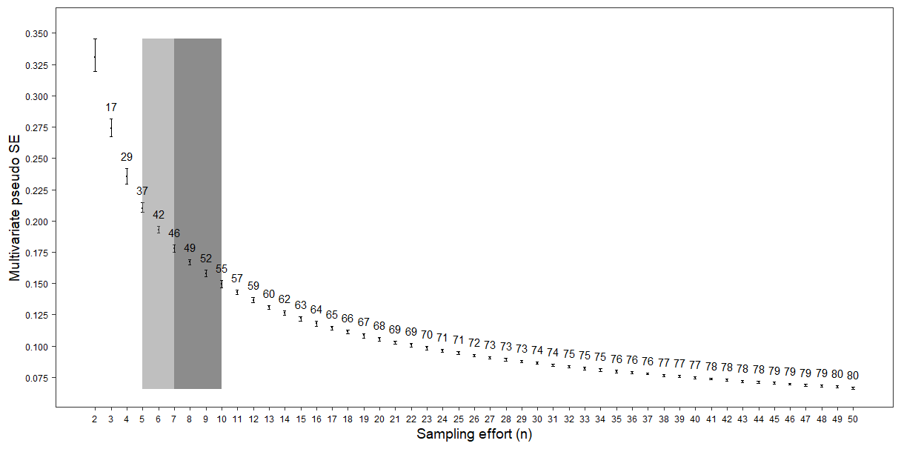

```{r setup, include = FALSE}
library(SSP)
library(ggplot2)

knitr::opts_chunk$set(
  collapse = TRUE,
  comment = "#>",
  fig.retina=2,
  fig.align='center',
  fig.width = 7, 
  fig.height = 5,
  warning = FALSE,
  message = FALSE
)
```

`SSP` is an R package design to estimate sampling effort in studies of ecological communities based on the definition of pseudo multivariate standard error (*MultSE*) (Anderson & Santana-Garcon 2015). This guide will provide you a brief overview in how to use `SSP`. The theoretical background are described in a submitted paper by Guerra-Castro et al. (2019).

The protocol in `SSP` consists in simulating several extensive data matrices that mimic some of the relevant ecological features of the community of interest using a pilot data set. For each simulated data, several sampling efforts are repeatedly executed and *MultSE* is calculated to each one. The mean value, 0.025 and 0.975 quantiles of *MultSE* for each sampling effort across all simulated data are then estimated, and optionally plotted using `ggplot2`. The mean values are then standardized regarding the lowest sampling effort (consequently, the worst precision), and an optimal sampling effort can be identified as that in which the increase in sample size do not improve the precision beyond a threshold value (e.g. 1 %).

`SSP` include six functions: `assempar` for extrapolation of assemblage parameters using pilot data; `simdata` for simulation of several data sets based on extrapolated parameters; `datquality` for evaluation of plausibility of simulated data; `sampsd` for repeated estimations of *MultSE* for different sampling designs in simulated data sets; `summary_sd` for summarizing  the behavior of *MultSE* for each sampling design across all simulated data sets, and `ioptimum` for identification of the optimal sampling effort.

## PACKAGE NEEDED IN SSP
- Required: `vegan`, `sampling`, `stats` [R](https://cran.r-project.org/)
- Suggested: `ggplot2` [R](https://cran.r-project.org/)
- Also `devtools`, `httr` to build `SSP` from [github](https://github.com/edlinguerra/SSP)

## HOW TO RUN SSP:
The `SSP` package will be available on [CRAN](https://cran.r-project.org/) but can be downloaded from github using the following commands:  

```{r eval=FALSE}
## install SSP package from CRAN
install.packages("SSP")

## install the latest version from github
install.packages('devtools')
library(devtools)
install_github('edlinguerra/SSP')

## import packages
library(SSP)
library(ggplot2)
```
------------

## FUNCTIONS AND SEQUENCE

The first function to use is `assempar`. The arguments of this functions are:

<table style="width:100%;">
<colgroup>
<col width="20%">
<col width="80%">
</colgroup>
<thead>
<tr class="header">
<th align="center">Argument</th>
<th align="left">Description</th>
</tr>
</thead>
<tbody>
<tr class="odd">
<td align="center"><code>data</code></td>
<td align="left">a <code>data.frame</code> with species names (columns) and samples (rows) information. The first column should indicate the site to which the sample belongs, regardless of whether a single site has been sampled.</td>
</tr>
<tr class="even">
<td align="center"><code>type</code></td>
<td align="left">Nature of the data to be processed. It may be presence / absence ("P/A"), counts of individuals ("counts"), or coverage ("cover").</td>
</tr>
<tr class="odd">
<td align="center"><code>Sest.method</code></td>
<td align="left">Method for estimating species richness. The function function <code>specpool</code> is used for this. Available methods are the incidence-based Chao "chao", first order jackknife "jack1", second order jackknife "jack2" and Bootstrap "boot". By default, the "average" of the four estimates is used.</td>
</tr>

</tbody>
</table>

This function extracts the main parameters of the pilot data using basic R functions as well as functions like `specpool` and `dispweight` from `vegan`. The expected number of species in the assemblage is estimated using non-parametric methods (Gotelli et al. 2011). Due to the variability in the estimates of each approximation (Reese et al. 2014), we recommend using an average of these. The probability detection of each species is estimated among and within sites. The former is calculated as the frequency of occurrences of each of the species against the number of sites sampled, the second as the weighted average frequencies in sites where the species were present. Also, the degree of spatial aggregation of species (only for real counts of individuals), is identified with the index of dispersion D (Clarke et al. 2006). The corresponding properties of unseen species are approximated using information of observed species. Specifically, the probabilities of detection are assumed to be equal to the rarest species of pilot data. The mean (and variance) of the abundances are defined using random poisson values with lambda as the overall mean of species abundances. `assempar`	returns an object of class `list`, to be used by `simdata`.

The second function to use is `simdata`, with the following arguments:

<table style="width:100%;">
<colgroup>
<col width="20%">
<col width="80%">
</colgroup>
<thead>
<tr class="header">
<th align="center">Argument</th>
<th align="left">Description</th>
</tr>
</thead>
<tbody>
<tr class="odd">
<td align="center"><code>Par</code></td>
<td align="left">a <code>list</code> of parameters estimated by <code>assempar</code>.</td>
</tr>
<tr class="even">
<td align="center"><code>cases</code></td>
<td align="left">Number of data sets to be simulated.</td>
</tr>
<tr class="odd">
<td align="center"><code>N</code></td>
<td align="left">Total number of samples to simulate in each site.</td>
</tr>
<tr class="even">
<td align="center"><code>sites</code></td>
<td align="left">Total number of sites to simulate in each data set.</td>
</tr>

</tbody>
</table>

The presence/absence of each species at each site are simulated with Bernoulli trials and probability of success equals to the empirical frequency of occurrence of each species among sites in the pilot data. For sites with the presence of the species, Bernoulli trials are used, with a probability of success equal to the estimated empirical frequency within the sites where it appears, to simulate the distribution of the species at that site. Once created, the P/A matrixes are converted to matrixes of abundances replacing presences by random values from an adequate statistical distribution and parameters equals to those estimated in the pilot data. Counts of individuals are generated using Poisson or negative binomial distributions, depending on the degree of aggregation of each species in the pilot data (McArdle & Anderson 2004; Anderson & Walsh 2013). When abundances were measured as a continuous variable (i.e. coverage, biomass), they are generated using the lognormal distribution. The simulation procedure is repeated to generate as many simulated data matrixes as needed. This function returns an object of class `list` that will be used by `sampsd` and `datquality`.

The third function is `sampsd`. If several sites had been generated (multi.site = TRUE), subsets of sites of size 2 to m are sampled, followed by the selection of sampling units (from 2 to p.n) using inclusion probabilities and self-weighted two-stage sampling (Tille, 2011). Each combination of sampling effort (number of sample units and sites), are repeated several times (e.g. k = 100) for all simulated matrixes. If simulated data correspond to a single site (multi.site = FALSE), sampling without replacement is performed several times (e.g. k = 100) for each sample size (from 2 to n) within each simulated matrix. This approach is computationally intensive, especially when k is high. Keep this in mind because it will affect the time to get results. For each sample, suitable pre-treatments are applied and distance/similarity matrixes estimated using the appropriate coefficient. When simulations were done for a single site, the *MultSE* is estimated as $\sqrt{V/n}$, being V the pseudo variance measured at each sample of size n (Anderson & Santana-Garcon, 2015). When several sites were generated, *MultSE* are estimated using the residual mean squares and the sites mean squares from a PERMANOVA model (Anderson & Santana-Garcon, 2015). The arguments of this function:

<table style="width:100%;">
<colgroup>
<col width="20%">
<col width="80%">
</colgroup>
<thead>
<tr class="header">
<th align="center">Argument</th>
<th align="left">Description</th>
</tr>
</thead>
<tbody>
<tr class="odd">
<td align="center"><code>dat.sim</code></td>
<td align="left">a <code>list</code> of data sets generated by <code>simdata</code></td>
</tr>
<tr class="even">
<td align="center"><code>Par</code></td>
<td align="left">a <code>list</code> of parameters estimated by <code>assempar</code></td>
</tr>
<tr class="odd">
<td align="center"><code>transformation</code></td>
<td align="left">Mathematical function to reduce the weight of very dominant species: 'square root', 'fourth root', 'Log (X+1)', 'P/A', 'none'</td>
</tr>
<tr class="even">
<td align="center"><code>method</code></td>
<td align="left">The appropiate distance/dissimilarity metric. The function <code>vegdist</code> is call for that purpose</td>
</tr>
<tr class="odd">
<td align="center"><code>multi.site</code></td>
<td align="left">Logical argument indicating if several sites were simulated</td>
</tr>
<tr class="even">
<td align="center"><code>N</code></td>
<td align="left">Total number of samples simulated for each site</td>
</tr>
<tr class="odd">
<td align="center"><code>n</code></td>
<td align="left">Maxinum number of samples to take at each site. Can be equal or less than N</td>
</tr>
<tr class="even">
<td align="center"><code>sites</code></td>
<td align="left">Total number of sites to simulate in each data set.</td>
</tr>
<tr class="odd">
<td align="center"><code>m</code></td>
<td align="left">Maxinum number of sites to sample at each data set</td>
</tr>
<tr class="even">
<td align="center"><code>k</code></td>
<td align="left">Number of repetitions of each combination between N and sites</td>
</tr>

</tbody>
</table>

After the sampling proceadure and estimation of *MultSE*, `summary_ssp` is requiered to estimate the mean of *MultSE* of all *k* repetitions within each simulated data, and then an overall mean as well as the lower and upper intervals of means for each sample size among all simulated data. In order to have a general and comparable criteria to evaluate the rate of change of the averaged *MultSE* with respect to the sampling effort, a relativization to the maximum *MultSE* value (obteined with the lower sampling effort) is calculated; then, a standard forward finite derivation is computed. All this results are presented in a data frame, that can be used to plot *MultSE* with respect to the sampling effort. The arguments of this function are:


<table style="width:100%;">
<colgroup>
<col width="20%">
<col width="80%">
</colgroup>
<thead>
<tr class="header">
<th align="center">Argument</th>
<th align="left">Description</th>
</tr>
</thead>
<tbody>
<tr class="odd">
<td align="center"><code>results</code></td>
<td align="left">a <code>matrix</code> generated by <code>sampsd</code></td>
</tr>
<tr class="even">
<td align="center"><code>multi.site</code></td>
<td align="left">Logical argument indicating whether several sites were simulated</td>
</tr>

</tbody>
</table>

The fifth function, `ioptimum` estimates what we consider the optimal improvement. The function identifies three cut-off points based on the finite derivative between the standardized *MultSE* and the sampling effort (as the percentage improvement in precision per sample unit), allowing us to identify: (1) the minimum required improvement, (2) sub-optimal improvement, (3) optimal improvement and (4) unnecessary improvement. The arguments are:

<table style="width:100%;">
<colgroup>
<col width="20%">
<col width="80%">
</colgroup>
<thead>
<tr class="header">
<th align="center">Argument</th>
<th align="left">Description</th>
</tr>
</thead>
<tbody>
<tr class="odd">
<td align="center"><code>xx</code></td>
<td align="left">a <code>data frame</code> generated by <code>summary_ssp</code></td>
</tr>
<tr class="even">
<td align="center"><code>multi.site</code></td>
<td align="left">Logical argument indicating whether several sites were simulated</td>
</tr>

</tbody>
</table>

It could be desirable to measure the plausibility of simulated data. This can be done measuring the resemblance these had to the pilot data. This can be assessed with `datquality`, a function that estimate: the average number of species per sampling unit, (ii) the average species diversity per sampling unit, defined as the average Simpson diversity index per sampling unit, and (iii) the multivariate dispersion (*MVD*), measured as the average dissimilarity from all sampling units to the main centroid in the space of the dissimilarity measure used (Anderson 2006). The arguments of this functions are:

<table style="width:100%;">
<colgroup>
<col width="20%">
<col width="80%">
</colgroup>
<thead>
<tr class="header">
<th align="center">Argument</th>
<th align="left">Description</th>
</tr>
</thead>
<tbody>
<tr class="odd">
<td align="center"><code>data</code></td>
<td align="left">a <code>data.frame</code> with species names (columns) and samples (rows) information. The first column should indicate the site to which the sample belongs, regardless of whether a single site has been sampled.</td>
</tr>
<tr class="even">
<td align="center"><code>dat.sim</code></td>
<td align="left">a <code>list</code> of data sets generated by <code>simdata</code></td>
</tr>
<tr class="odd">
<td align="center"><code>Par</code></td>
<td align="left">a <code>list</code> of parameters estimated by <code>assempar</code>.</td>
</tr>
<tr class="even">
<td align="center"><code>transformation</code></td>
<td align="left">Mathematical function to reduce the weight of very dominant species: 'square root', 'fourth root', 'Log (X+1)', 'P/A', 'none'</td>
</tr>
<tr class="odd">
<td align="center"><code>method</code></td>
<td align="left">The appropiate distance/dissimilarity metric. The function <code>vegdist</code> is call for that purpose</td>
</tr>

</tbody>
</table>

-------------

## Performance of SSP with real data
 
**Micromollusks of marine shallow sandy bottoms:** Presence/absence of 67 species were registered in six cores of 4-inch diameter and 10 cm depth taken in sandy bottoms around Cayo Nuevo, Gulf of Mexico, Mexico (a small reef cay located 240 km off the North-Western coast of Yucatan). Data correspond to a study on the biodiversity of marine benthic reef habitats off the Yucatan shelf (Ortigosa et al. 2018). The main objective was to estimate an adequate sampling effort for further quantitative studies to characterize the variability in species composition. To do this, the pilot data was characterized with `assempar` and several matrices of P/A data were simulated with `simdata`. To speed up the process, only 10 data sets (*cases*) were simulated, each data matrix consisted in 50 potential sampling replicates in one site. Various sample size’s subsets (*n* = 2 to 50) were repeatedly sampled (*k* = 10) with `sampsd`. The Jaccard index was used as the similarity measure between sample units. Keep in mind that you can simulate many more matrices (*cases*), potential number of samples (*n*), and sampling repetitions (*k*), as long as you have the time and patience to wait for the results!

```{r eval=FALSE}
data(micromollusk)

#Estimation of parameters
par.mic<-assempar(data = micromollusk, type = "P/A")

#Simulation of data
sim.mic<-simdata(Par = par.mic, cases = 10, N = 50, site = 1)

#Sampling and estimation of MultSE
samp.mic<-sampsd(sim.mic, par.mic,
                        transformation = "P/A",
                        method = "jaccard",
                        multi.site = FALSE,
                        N = 50,
                        n = 50,
                        sites = 1,
                        m = 1,
                        k = 10)

#Summarizing results
sum.mic<-summary_ssp(results = samp.mic, multi.site = FALSE)

#Identification of optimal effort

opt.mic<-ioptimum(xx = sum.mic, multi.site = FALSE, c1 = 5, c2 = 3, c3 = 1)

```

The behavior of *MultSE* for each sampling effort on simulated data sets can be plotted using `ggplot2` (Fig. 1). The shaded area indicates the range of samples in which each increase in the sampling effort provides between 3% and 1% improvement in precision for each aditional sample; we call this area the **optimal improvement**. Beyond 17 samples, the effort does not improve more than 1 % the higher *MultSE*, which can be considered as a redundant effort. 

```{r eval=FALSE}
fig.mic<-ggplot(sum.mic, aes(x=samples, y=mean))+
  geom_point(size = 0.5)+
  geom_errorbar(aes(ymin=lower, ymax=upper), size=0.1, width=.2)+
  theme_bw(base_size=16) +
  ylab ("Multivariate pseudo SE")+ 
  xlab("Sampling effort (n)")+
  scale_y_continuous(breaks=seq(0.0, 0.4, 0.025))+
  scale_x_continuous(breaks=seq(2, 50, 2))+
  theme(axis.text.x = element_text(colour="black", size=rel(0.7)),
        axis.text.y = element_text(colour="black", size=rel(0.7)),
        axis.title.x = element_text(colour="black", size=rel(0.9)),
        axis.title.y = element_text(colour="black", size=rel(0.9)),
        panel.grid.major = element_blank(),
        panel.grid.minor = element_blank(),
        panel.border = element_rect(size=0.4),
        axis.ticks= element_line(size=0.2))+
  annotate("rect", xmin=opt.mic[2], xmax=opt.mic[3], ymin=min(sum.mic$lower),
           ymax=max(sum.mic$upper), alpha=.1, fill="blue")+
  annotate("text", x=12.5,  y = 0.325, label = "Optimal", 
           fontface = "bold", size = 3 )+
  annotate("text", x=12.5,  y = 0.315, label = "improvement", 
           fontface = "bold", size = 3 )
fig.mic 
```

```{r, echo = FALSE, out.width='85%', fig.align='center', fig.cap='Fig. 1. MultSE and smapling effort relationship using micromollusk simulated data'}

```
  

**Coral reef sponges:** Spatial variability of sponge diversity in reefs from Alacranes Reef National Park (ARNP), Gulf of Mexico, Mexico, was estimated in 36 transects of 20 m × 1 m across 6 sites (≈ 4 to 5 transect per site). In each transect, the colonies of 41 sponge species were counted. This data corresponds to a pilot study on sponge biodiversity in reef habitats in the Yucatán shelf (Ugalde et al. 2015). The main objective was to estimate an adequate sampling effort in two spatial scales (i.e. transect and sites) for further quantitative studies. The studied area represents the leeward area of the reef, with very similar reef geomorphology. Therefore, it cannot be argued a priori that spatial differences in sponge diversity (if any) are due to some environmental model. In this sense, we consider it valid to simulate for the entire leeward area, considering the information of the six sites.  
Several matrixes were simulated, each consisting in 20 potential *sites* with 20 potential *N* transects  per site. As well as the above example, the pilot data was characterized with `assempar` and several matrices with counts of individual sponges were simulated with `simdata`. Again, to speed up the process, only 10 data sets (*cases*) were simulated. Each combination of *n* (from 2 to 20) and *m* (from 2 to 20) were repeatedly sampled (*k* = 10) with `sampsd`. The Bray-Curtis index was used as the similarity measure between sample units after square root transformation of simulated abundances. As well, the optimal sampling effort was represented using plots, one for each source of variation.  

```{r eval=FALSE}
data(sponges)

#Estimation of parameters
par.spo<-assempar(data = sponges, type = "counts")

#Simulation of data
sim.spo<-simdata(Par = par.spo, cases = 10, N = 20, sites = 20)

#Sampling and estimation of MultSE
samp.spo<-sampsd(sim.spo, par.spo,
                        transformation = "square root",
                        method = "bray",
                        multi.site = TRUE,
                        N = 20,
                        n = 20,
                        sites = 20,
                        m = 20,
                        k = 10)

#Summarizing results
sum.spo<-summary_ssp(results = samp.spo, multi.site = TRUE)

#Identification of optimal effort

opt.spo<-ioptimum(xx = sum.spo, multi.site = TRUE, c1 = 5, c2 = 3, c3 = 1)


#Data frame to generate shade rectangles for sub optimal and optimal efforts for each source of variation

shade.opt<-data.frame("xmin" = c(opt.spo[1,2], opt.spo[2,2]),
                      "xmax" = c(opt.spo[1,3], opt.spo[2,3]),
                      "ymin" = c(min(sum.spo$lower), min(sum.spo$lower)),
                      "ymax" = c(max(sum.spo$lower), max(sum.spo$lower)),
                      "sv" = c("sites", "samples"),
                      "labels" = c("Optimal improvement", "Optimal improvement"),
                      "x" = c(13, 12))

shade.sub<-data.frame("xmin" = c(opt.spo[1,1], opt.spo[2,1]),
                      "xmax" = c(opt.spo[1,2], opt.spo[2,2]),
                      "ymin" = c(min(sum.spo$lower), min(sum.spo$lower)),
                      "ymax" = c(max(sum.spo$lower), max(sum.spo$lower)),
                      "sv" = c("sites", "samples"),
                      "labels" = c("Sub", "Sub"),
                      "x" = c(7, 7))


fig.spo<-ggplot(sum.spo, aes(x=samples, y=mean))+
        geom_point()+
        geom_errorbar(aes(ymin=lower, ymax=upper), width=.1)+
        facet_grid(.~sv)+
        theme_bw(base_size=16) +
        ylab ("Multivariate pseudo SE")+ 
        xlab("Sampling effort")+
        scale_x_continuous(breaks = c(2:20))+
        theme(axis.text.x = element_text(colour="black", size=rel(0.7)),
              axis.text.y = element_text(colour="black", size=rel(0.7)),
              axis.title.x = element_text(colour="black", size=rel(0.9)),
              axis.title.y = element_text(colour="black", size=rel(0.9)),
              panel.grid.major = element_blank(),
              panel.grid.minor = element_blank(),
              panel.border = element_rect(size=0.4),
              axis.ticks= element_line(size=0.2))+
        geom_rect(data = shade.opt, aes(x = NULL,y = NULL,xmin=xmin, xmax=xmax, 
                                  ymin=ymin, ymax=ymax), 
                                  alpha=0.1, fill="blue")+
        geom_text(data = shade.opt, y=0.25, aes(x = x, label=labels))+
        geom_rect(data = shade.sub, aes(x = NULL,y = NULL,xmin=xmin, xmax=xmax, 
                                  ymin=ymin, ymax=ymax), 
                                  alpha=0.1, fill="green")+
        geom_text(data = shade.sub, y=0.25, aes(x = x, label=labels))
  

fig.spo 


```

```{r, echo = FALSE, out.width='85%', fig.align='center', fig.cap='Fig. 2. MultSE and smapling effort relationship using sponge simulated data'}
knitr::include_graphics('fig2.png')
```
  
At the scale of sites, Fig.2 shows noticeable decrease and stabilization of the *MultSE* between 6 and 18 sites. This range of sampling is represented by two shaded areas: suboptimal and optimal improvement, respectively. The first represent improvements of 5-3 % for each additional site, the second highlight improvement of 3-1 % for each additional site; in both cases regarding the largest *MultSE*. Sampling eight sites will ensure improving the worst precision around 50 %, and almost 18 % regarding the original effort. At the scale of transect, the suboptimal improvement is accomplished with 6 or 7 replicates, the optimal is beyond 8 replicates. Beyond eight transect, each additional sample improves the highest *MultSE* by 1-3 %. Another outstanding feature is the marked differences in *MultSE* obtained for the two sources of variation. The magnitude of the difference in variation fits that obtained in the pseudo components of variation estimated for sites and residuals in a PERMANOVA analysis of the pilot data σ<sub>sites</sub> = 26.4, σ<sub>transects</sub> = 34.7): 

```{r}
dat<-sponges[,2:length(sponges)]

#Square root transformation of abundances
dat.t<-sqrt(dat)

#Bray-Curtys
library(vegan)
bc<-vegdist(dat.t, method = "bray")

#function to estimate components of variation in PERMANOVA 
cv.permanova <- function(D, y) {
  D = as.matrix(D)
  N = dim(D)[1]
  g = length(levels(y[,1]))
  X = model.matrix(~y[,1])  #model matrix
  H = X %*% solve(t(X) %*% X) %*% t(X)  #Hat matrix
  I = diag(N)  #Identity matrix
  A = -0.5 * D^2
  G = A - apply(A, 1, mean) %o% rep(1, N) - rep(1, N) %o% apply(A, 2, mean) + mean(A)
  MS1 = sum(G * t(H))/(g - 1)  #Mean square of sites
  MS2 = sum(G * t(I - H))/(N - g)  #Mean square of residuals
  CV1 = (MS1 - MS2)/(N/g)# Components of variation of sites
  CV2 = MS2 # Components of variation of samples
  CV = c(CV1, CV2)
  sqrtCV = sqrt(CV)
  return(sqrtCV) #square root of components of variation
}

cv<-cv.permanova(D = bc, y = sponges)
cv

```


With these projections, and considering the costs (time, money) of visiting a site and doing each transect, as well as the relative importance of each spatial scale, it will be convenient to keep the number of sites in 6, and to increase the number of transect to 8.  


------

## References

-Anderson, M. J. (2006). Distance-based tests for homogeneity of multivariate dispersions. Biometrics 62:245-253.

-Anderson, M. J., & J. Santana-Garcon. (2015). Measures of precision for dissimilarity-based multivariate analysis of ecological communities. Ecology Letters 18:66-73.

-Anderson, M. J., & D. C. I. Walsh. (2013). PERMANOVA, ANOSIM, and the Mantel test in the face of heterogeneous dispersions: What null hypothesis are you testing? Ecological Monographs 83:557-574.

-Clarke, K. R., Chapman, M. G., Somerfield, P. J., & Needham, H. R. (2006). Dispersion-based weighting of species counts in assemblage analyses. Journal of Experimental Marine Biology and Ecology, 320, 11-27.

-Gotelli, N. J., & Colwell, R. K. (2011). Estimating species richness. Pages 39– 54 in A Magurranand B McGill editors. Biological diversity: frontiers in measurement and assessment. Oxford University Press, Oxford, UK.

-McArdle, B. H., & M. J. Anderson. (2004). Variance heterogeneity, transformations, and models of species abundance: a cautionary tale. Canadian Journal of Fisheries and Aquatic Sciences 61:1294-1302.

-Oksanen, J., F. G. Blanchet, R. Kindt, P. Legendre, P. R. Minchin, R. B. O'Hara, G. L. Simpson, P. Solymos, M. H. H. Stevens, and H. Wagner. 2019. Vegan: Community Ecology Package. R package version 2.5-6.

-Ortigosa, D., N. Y. Suárez-Mozo, N. C. Barrera, & N. Simões. (2018). First survey of Interstitial molluscs from Cayo Nuevo, Campeche Bank, Gulf of Mexico. Zookeys 779.

-Reese, G. C., Wilson, K. R., & Flather, C. H. (2014). Performance of species richness estimators across assemblage types and survey parameters. Global Ecology and Biogeography, 23(5), 585-594.

-Ugalde, D., P. Gómez, & N. Simoes. (2015). Marine sponges (Porifera: Demospongiae) from the Gulf of México, new records and redescription of Erylus trisphaerus (de Laubenfels, 1953). Zootaxa 3911:151-183.
